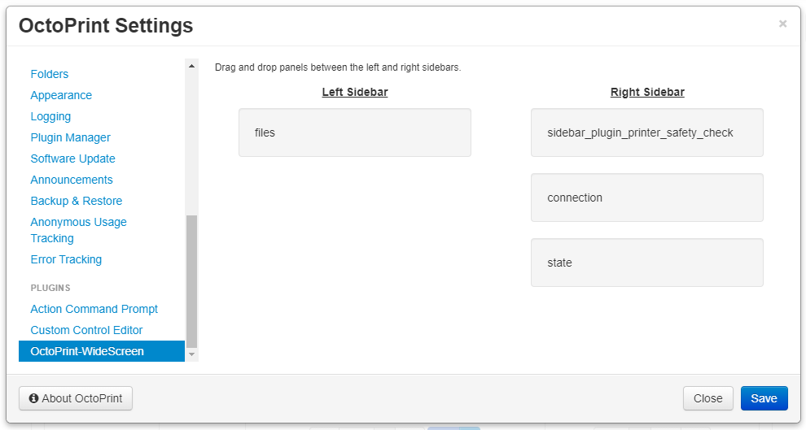

# OctoPrint-WideScreen

Once installed open settings and drag the panels between the left and right sidebars.

## Setup

Install via the bundled [Plugin Manager](https://github.com/foosel/OctoPrint/wiki/Plugin:-Plugin-Manager)
or manually using this URL:

    https://github.com/jneilliii/OctoPrint-WideScreen/archive/master.zip

## Configuration

Once installed open settings and select which sidebar panels should be moved to the right side.

## Get Help

If you experience issues with this plugin or need assistance please use the issue tracker by clicking issues above.

### Additional Plugins

Check out my other plugins [here](https://plugins.octoprint.org/by_author/#jneilliii)

### Sponsors
- Andreas Lindermayr
- [@Mearman](https://github.com/Mearman)
- [@TxBillbr](https://github.com/TxBillbr)
- Gerald Dachs
- [@TheTuxKeeper](https://github.com/thetuxkeeper)
- @tideline3d
- [SimplyPrint](https://simplyprint.dk/)

### Support My Efforts
I, jneilliii, programmed this plugin for fun and do my best effort to support those that have issues with it, please return the favor and leave me a tip or become a Patron if you find this plugin helpful and want me to continue future development.

 

<small>No paypal.me? Send funds via PayPal to jneilliii&#64;gmail&#46;com</small>